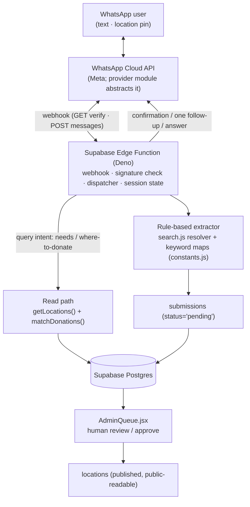
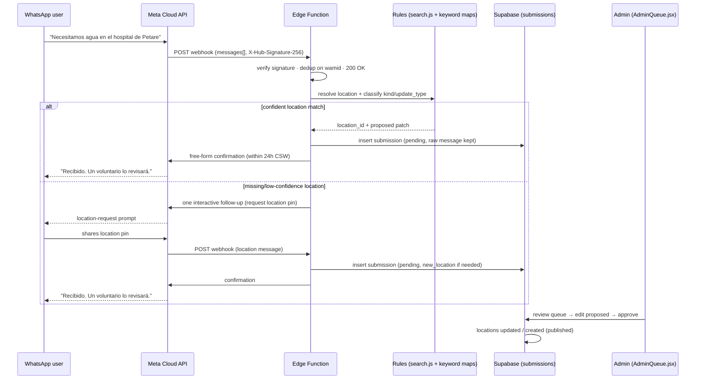

# Plan — WhatsApp Aid-Reporting Agent for *Mapa de Ayuda*

**Repo:** `cdifino/unamanovzla` · **Production:** `www.unamanovzla.com`
**Author:** dmon · **Date:** 2026-06-30 · **Status:** Plan / pre-implementation — for peer review

> **Purpose.** Add a WhatsApp intake channel to *Mapa de Ayuda* so people in low-connectivity,
> post-earthquake conditions can report needs (and ask questions) without loading the web app.
> This document is the shareable, source-controlled plan: it captures the decided approach,
> how it maps onto the existing code, a phased roadmap, and a draft issue breakdown for tracking.
>
> It consolidates two research artifacts produced earlier in this effort:
> 1. **WhatsApp API research** — how the Cloud API, webhooks, sending, pricing, and providers work.
> 2. **WhatsApp agent proposal** — the project-specific framing (access argument, precedent, fit).
>
> Both are summarized inline here so this doc stands alone for a reviewer.

---

## 1. TL;DR / recommendation

**Build it as a thin, server-side writer into the existing `submissions` table — not a parallel system.**

A WhatsApp agent attacks the project's biggest *reach* limitation: the site is a single-page map app
that a degraded post-quake connection often cannot load, while the majority of online Venezuelans live
in WhatsApp. Every WhatsApp message lands in the **same** admin review queue humans already use, so the
new trust surface is minimal.

**Decided shape (see §3 for rationale):**

| Decision | Choice |
|---|---|
| Architecture | Thin **server-side writer into `submissions`** — reuse the existing moderation queue |
| Hosting | One **Supabase Edge Function** (Deno), inserting with the `service_role` key |
| Provider | **Meta Cloud API** (first-party, lowest per-message cost), behind a **swappable provider module** |
| Intake model | **Hybrid:** stateless rule-based extraction + **one** interactive follow-up for a missing required field |
| Voice notes | **Out of scope for v1** (drops the speech-to-text dependency and cost) |
| LLM | **None on the MVP critical path.** Rule-based (`search.js` + keyword maps) + human review. Optional, flag-gated LLM "extract-assist" as a late enhancement |
| Moderation | Unchanged — every message enters as `status='pending'`; **no auto-publish, ever** |

**Effort:** Medium. One Edge Function (webhook + dispatcher), a provider module, a rule-based
extraction/resolution layer reusing `src/lib/search.js`, and a small WhatsApp Business setup. No frontend
changes required for v1.

**Guardrail:** the agent is **extract-only**; a human confirms every parsed report in the queue. Never
auto-publish severity (life-safety + misinformation risk).

---

## 2. Context — why WhatsApp (the access argument)

| Signal | Figure | Source |
|---|---|---|
| Internet penetration | **61.6%** (~17.5M) → **~40% offline**, concentrated rurally | [DataReportal — Digital 2025: Venezuela](https://datareportal.com/reports/digital-2025-venezuela) |
| Mobile connections | 22.5M (79.1% of population) | [DataReportal 2025](https://datareportal.com/reports/digital-2025-venezuela) |
| WhatsApp among internet users | **~90%** regular use | [Statista — WhatsApp usage by country 2025](https://www.statista.com/statistics/291540/mobile-internet-user-whatsapp/) |

**Why WhatsApp specifically fits a post-quake context:**

- **Low data / often zero-rated** — works on degraded networks where map tiles + a JS bundle will not.
- **Native location-pin sharing** — solves the single hardest part of the web flow (placing a point on
  the map) for free, with no GPS-entry UI to build.
- **Already installed** — no app to download, no URL to find, no login.

**Precedent (humanitarian WhatsApp bots that work):** Red Crescent (Libya floods, Derna 2023), WFP Yemen
food-aid assessment, South Africa NDoH "HealthAlert" (COVID-19), UNICEF U-Report, IRC Greece. Common
design lessons — structured intake, local-language support, and **verification/moderation to reduce
fraud** — all map cleanly onto this project's existing `pending → approved` model.

> **Uncertainty note.** Connectivity figures are 2025 national estimates; rural post-earthquake
> conditions may differ. WhatsApp Business pricing/approval rules change — verify current Meta terms at
> build time.

---

## 3. Key decisions and rationale

### 3.1 Why a new server component is unavoidable

The app today is a **static React/Vite SPA on GitHub Pages** that talks **directly to Supabase** from the
browser with the publishable (anon) key (`src/lib/supabaseClient.js`, `.github/workflows/deploy.yml`).
WhatsApp's API is **webhook-driven**: Meta delivers inbound messages by POSTing to a **public HTTPS
endpoint** you control. GitHub Pages cannot host that. So the one hard requirement is a small server
piece. A **Supabase Edge Function** is the natural fit — it is already the project's stack, and its
`service_role` secret can insert into `submissions` server-side (bypassing the browser-only RLS path).

### 3.2 Provider — Meta Cloud API, abstracted

Default to the **Meta Cloud API** (first-party, lowest per-message cost, no reseller markup). Keep all
provider specifics — webhook verification, signature check, send calls, payload parsing — behind a single
**provider module** with a narrow interface, so a future switch to a BSP (Twilio / 360dialog) is a
one-file change. Prototyping can use Meta's test number (free) before a production number is provisioned.

### 3.3 Intake model — hybrid (stateless + one follow-up), no voice

- **Default path is stateless:** the user sends one free-text message; the agent extracts what it can
  with rules and inserts a `pending` submission. **Fewest round-trips**, which matters most on bad
  networks.
- **One targeted follow-up** only when a *required* field is missing or low-confidence (primarily
  location): the agent sends a single **native interactive prompt** — a location-request / a short
  button or list picker — so the user supplies structure directly, no NLP needed. This needs a light,
  short-TTL per-sender session store (added when location handling lands in Phase 2).
- **Voice notes are out of scope for v1.** They are the main driver of speech-to-text cost and
  complexity; defer until the text path is proven.

### 3.4 Why no LLM on the MVP critical path

The agent must produce a `submissions` row whose `proposed` patch a human approves anyway. "Good enough"
is reachable without an LLM:

- **Location resolution** → compose a resolver from `src/lib/search.js` (`normalize` + `matchLocation`
  over `repo.getLocations()`), or fall back to `new_location=true`. **$0.**
- **`kind` / `update_type` classification** → keyword maps over the enums in `src/data/constants.js`.
  **$0, deterministic.**
- **Missing required field** → the hybrid interactive follow-up.
- **Everything else** → stored verbatim in `message` and structured by the human reviewer in the
  existing `AdminQueue`.

An LLM would mainly **reduce reviewer effort** (pre-fill `proposed`, infer severity) — useful, but it
adds a vendor dependency, **sends message text to a third party** (a real downside in this political
context), and introduces hallucination risk. So it is deferred to an **optional, flag-gated** enhancement
that is **off by default** (Phase 4).

---

## 4. Architecture

**Two intents the agent handles:**

- **Report (write):** "Necesitamos agua y medicinas en la parroquia X" / a location pin → rule-based
  parse → `submissions` (`pending`) → queue.
- **Query (read):** "¿Qué hace falta en el Hospital Y?" / "¿Dónde puedo donar sangre O-?" → answered from
  live `locations` data.

**Net-new surface:** one Edge Function, one provider module, a rule/keyword layer, a WhatsApp Business
number, and a tiny session store for follow-ups. That is it.

---

## 5. How the WhatsApp integration works (mechanics summary)

This is the API-focused core. All endpoints are on the Meta Cloud API; **verify the current Graph API
version at build time** (v25.0+ at time of writing).

### 5.1 Inbound (webhooks)

- **Verification handshake (one-time):** Meta sends `GET` with `hub.mode`, `hub.verify_token`,
  `hub.challenge`. The function checks the token matches a configured secret and echoes back
  `hub.challenge` as plain text with `200`.
- **Message delivery:** Meta sends `POST` with a JSON envelope. Every message type shares the shape
  `entry[].changes[].value.messages[]`, plus `value.contacts[]` (sender wa-id + profile name) and
  `value.metadata.phone_number_id`. Message types relevant to v1: **text** and **location**
  (interactive button/list replies arrive as `interactive` for the follow-up path).
- **Security (must-do):** validate the **`X-Hub-Signature-256`** header — HMAC-SHA256 of the **raw**
  request body keyed by the app secret — before trusting any payload.
- **Reliability (must-do):** respond `200` fast (do heavy work after acknowledging, or keep it quick);
  **deduplicate on the message `id` (`wamid`)** because Meta retries on non-200 / timeout.

### 5.2 Outbound (sending) and the 24-hour rule

- **Send endpoint:** `POST https://graph.facebook.com/<version>/<PHONE_NUMBER_ID>/messages` with
  `Authorization: Bearer <token>` and a JSON body (`type: text | interactive | location | template`).
- **24-hour Customer Service Window (CSW):** once a user messages you, you may reply with **free-form**
  messages for 24 hours. **Outside** that window you can only re-initiate with a **pre-approved
  template**. For an inbound help-line this is favorable: confirmations and follow-ups within the
  conversation are free-form, and **user-initiated service conversations are not charged** under the
  current per-message model. (Pricing is per-message since 2025-07-01; verify Venezuela's rate band on
  Meta's live rate card.)
- **Interactive messages** (`type: interactive`, `button`/`list`) drive the single follow-up without NLP.
- **Location:** the agent can request/receive a location pin; inbound location messages carry
  `latitude`/`longitude` directly.

### 5.3 Auth & onboarding (entities you must create)

A **Meta Business account** → a **WhatsApp Business Account (WABA)** → a **registered phone number**
(`PHONE_NUMBER_ID`) → an **app** with webhooks configured. Use a **System User permanent token** with
scopes `whatsapp_business_messaging` + `whatsapp_business_management`. Business verification and a
display-name review gate higher messaging tiers. **Secrets live only in the Edge Function environment —
never in the repo or the SPA bundle.**

---

## 6. Data-model mapping → `submissions`

Target table: `supabase/schema.sql:29-44`. The agent fills the same fields the web forms produce; the
closest analog is the **"propose a new point"** flow (`NewLocationForm.jsx:48-58`).

| `submissions` column | WhatsApp agent source |
|---|---|
| `location_id` (FK, nullable) | resolved via the `search.js` resolver; `null` when proposing a new point |
| `location_name` | parsed/matched name |
| `kind` | inferred (`hospital` / `parroquia` / `otro`) by keyword map |
| `submitter_name` | WhatsApp profile name (if shared) |
| `submitter_contact` | WhatsApp phone number — **PII, see §9 / Issue 11** |
| `update_type` | classified by keyword (`estado` / `suministros` / `sangre` / `punto_donacion` / `otro`; or `nuevo_punto` for a new point). **Free-text column — not enum-constrained** |
| `message` (**NOT NULL**) | the original inbound text, verbatim (kept for auditability) |
| `proposed` (jsonb) | structured patch the rules extracted (the editable diff the reviewer sees) |
| `new_location` (bool) | `true` when no confident match → mirrors the web propose-a-point flow |
| `status` | **always `pending`** (the agent never sets `approved`) |

**Two `proposed` shapes** (mirroring the existing forms):

- **Existing-location update:** `proposed` is a *status patch* (subset of `status_level`, `summary`,
  `supplies_needed`, `donation_poc`, `rescue_teams`, `buildings_searched`, `people_aided`,
  `blood_needed`, `blood_types`). On approve, the reviewer's edited `appliedPatch` is written to the
  location (`repository.js:289-291`).
- **New point:** `proposed` = `{ name, kind, state, municipio, lat, lng, …optional status fields }`.
  On approve, `locationFromProposal()` builds the new `locations` row — it **requires `lat`/`lng`**, so a
  new-point report must include a location pin (or get one via the follow-up) (`repository.js:80-97`,
  `:285-288`).

> Always keep the **raw original message** in `message` even when `proposed` is populated, so a reviewer
> can see what the person actually said vs. what the agent extracted.

**Provenance gap:** `submissions` has **no `source` column** today. Recording `source='whatsapp'` (and a
pseudonymized sender reference) requires a small additive migration — tracked in **Issue 11** and aligned
with existing issue **#5** (per-row provenance).

**RLS note:** the browser inserts under policy `submissions_insert_public` (`status='pending'` only,
`schema.sql:104-106`). The Edge Function uses **`service_role`**, which **bypasses RLS**, so it inserts
directly — the policy is irrelevant to the agent but must stay intact for the web app.

---

## 7. End-to-end sequence (report path)

---

## 8. Phased roadmap

- **Phase 0 — Spike / de-risk.** Meta Cloud API **test number** + Edge Function webhook (GET verify +
  POST echo). Prove a `service_role` insert into `submissions` appears in `AdminQueue`.
- **Phase 1 — Text reporting MVP (no LLM).** Inbound text → rule-based resolution + classification →
  `pending` submission with raw `message` + lightweight `proposed`; **hybrid follow-up** for a missing
  required field; Spanish confirmation; signature validation + `wamid` dedup; unit tests for the
  resolver.
- **Phase 2 — Location pin + read/query intent.** Accept native location pins → `lat`/`lng` (with
  `inRegion()` check); answer needs / where-to-donate questions from `getLocations()` + `matchDonations()`.
- **Phase 3 — Hardening & ops (epics).** Per-number rate limiting + length caps + abuse handling
  (ties **#12**); PII policy — sender-ID pseudonymization + retention + `source='whatsapp'` provenance
  (ties **#12**, **#5**); basic analytics.
- **Phase 4 — Optional LLM extract-assist (epic, off by default).** Flag-gated pre-fill of `proposed` +
  severity inference for low-confidence cases; strict JSON validation; cheap model; documented
  cost/privacy tradeoff.

**Non-goals (v1):** voice notes, auto-publishing, admin actions over WhatsApp, non-Spanish, payments /
logistics, LLM on the critical path.

---

## 9. Risks & mitigations

| Risk | Mitigation |
|---|---|
| **Spam / DoS amplification** | Per-number + per-window rate limiting in the function; length caps. The phone number is a natural throttle key the web form lacks. Reuse **#12**. |
| **PII at scale** (phone numbers, sensitive political context) | Minimize stored PII; pseudonymize/hash sender IDs; retention/cleanup policy; admin-only reads via RLS (already the model). Tracked in Issue 11 / **#12**. |
| **Misinformation / wrong severity** | Extract-only; **human confirms every report**; never auto-publish; keep raw `message`. Deferring the LLM removes a hallucination surface from the MVP. |
| **Moderation bottleneck** | Triage by parsed `update_type`/severity in the queue; track approval throughput; raises the value of realtime sync (**#8**). |
| **Provider lock-in / cost** | Provider module isolates Meta vs. BSP; start on Meta Cloud API. |
| **Reliability during a real disaster** | Edge Functions scale; fast `200` + dedup; graceful "te responderemos pronto" fallback on internal error. |

---

## 10. Cost & infrastructure notes

- **WhatsApp Business Platform** needs a Meta Business account, a registered number, and (for v1) the
  Meta Cloud API. Business verification + at least one approved template (only needed to *initiate*
  outside the 24h window — the inbound help-line rarely needs this).
- **Pricing** is per-message (since 2025-07-01). **User-initiated service conversations are not charged**
  under the current model, and free-form replies within the 24h CSW are free — favorable for this use
  case. Confirm Venezuela's rate band on Meta's live rate card (sources differ between "Rest of Latin
  America" and "Other"; both are low-cost; billing is USD).
- **Hosting:** Supabase Edge Functions (Deno); `service_role` secret in the function environment only.
- **No STT and no LLM cost in the MVP** (voice deferred; LLM optional/off).

---

## 11. Issue breakdown (draft — for tracking)

One umbrella **epic** + child issues. Phase 0–1 are detailed with acceptance criteria; Phase 2 is medium;
Phase 3–4 are lightweight epics. New labels needed: **`whatsapp`**, **`epic`**. Existing-backlog links:
**#12** (hardening), **#8** (realtime), **#5** (provenance), **#10** (tests/CI), **#3** (VE-only data).

> These are drafted here for review. They will be filed in `cdifino/unamanovzla` only after this doc is
> approved.

### Epic
**`[Epic] WhatsApp aid-reporting agent`** — labels: `epic`, `enhancement`, `P1`
Links this plan doc; tracks all child issues; references #12 / #8 / #5 / #10 / #3.

### Phase 0 — Spike
**Issue 1 · `[P1] WA Phase 0: Meta Cloud API number + Edge Function webhook (verify + echo)`**
labels: `whatsapp`, `enhancement`, `P1` · depends on: —
- **Goal:** stand up a test number + an Edge Function webhook that verifies and logs inbound messages.
- **Acceptance:** GET handshake echoes `hub.challenge` and the webhook shows "verified" in the Meta
  dashboard; an inbound text appears in function logs; signature check stubbed in.
- **Pointers:** new `supabase/functions/whatsapp/`; secrets in function env.

**Issue 2 · `[P1] WA Phase 0: service_role insert into submissions shows in AdminQueue`**
labels: `whatsapp`, `enhancement`, `P1` · depends on: 1
- **Goal:** from the function, insert a test row into `submissions` with `service_role`.
- **Acceptance:** a hardcoded `pending` submission appears in `AdminQueue.jsx` and is approvable end-to-end.
- **Pointers:** `supabase/schema.sql:29-44`, `src/lib/repository.js:260-268`, `AdminQueue.jsx`.

### Phase 1 — Text MVP (no LLM)
**Issue 3 · `[P1] WA: provider abstraction module (send/receive/verify interface)`**
labels: `whatsapp`, `enhancement`, `P1` · depends on: 1
- **Goal:** a narrow interface — `verifyWebhook`, `parseInbound`, `sendText`, `sendInteractive` — with a
  Meta Cloud API implementation.
- **Acceptance:** swapping providers touches only this module; no Meta specifics leak into the dispatcher.

**Issue 4 · `[P1] WA Phase 1: inbound text → submissions (rule-based extraction)`**
labels: `whatsapp`, `enhancement`, `P1` · depends on: 2, 3
- **Goal:** parse the inbound envelope; resolve location via a `search.js`-based resolver; keyword-classify
  `kind`/`update_type`; store raw `message` + lightweight `proposed`; insert `pending`; validate
  `X-Hub-Signature-256`; dedup on `wamid`.
- **Acceptance:** a Spanish text report creates a `pending` submission with a resolved `location_id` **or**
  `new_location=true`; raw text preserved in `message`.
- **Pointers:** `src/lib/search.js:5-34`, `src/data/constants.js:14-35`, `NewLocationForm.jsx:48-58`.

**Issue 5 · `[P1] WA Phase 1: hybrid interactive follow-up for missing required field`**
labels: `whatsapp`, `enhancement`, `P1` · depends on: 4
- **Goal:** when location is unresolved/low-confidence, send **one** interactive prompt (location-request
  or a short button/list picker); attach the reply via a short-TTL per-sender session store.
- **Acceptance:** a message with no resolvable location recovers in a single follow-up and still produces
  one `pending` submission (no duplicates).

**Issue 6 · `[P1] WA Phase 1: Spanish confirmation reply + raw-message auditability`**
labels: `whatsapp`, `enhancement`, `P1` · depends on: 4
- **Goal:** plain-language confirmation ("recibido, será revisado por un voluntario"); guarantee raw text
  is always retained in `message`.
- **Acceptance:** user receives a confirmation within the 24h CSW; reviewer sees raw `message` vs.
  `proposed`.

**Issue 7 · `[P1] WA Phase 1: unit tests for location-resolution + classification`**
labels: `whatsapp`, `testing`, `P1` · depends on: 4 · ties **#10**
- **Goal:** pure-function tests for the resolver and keyword maps (match / no-match / ambiguous).
- **Acceptance:** tests run in the project's chosen runner and cover the resolution fallbacks.

### Phase 2 — Location pin + read intent
**Issue 8 · `[P2] WA Phase 2: accept native location pin → lat/lng (+ inRegion check)`**
labels: `whatsapp`, `enhancement`, `P2` · depends on: 4
- **Goal:** handle inbound location messages; feed `lat`/`lng` into `proposed`; apply the `inRegion()`
  bounding box (lat 9.5–11.2, lng −67.6…−65.5) before accepting a new point.
- **Pointers:** `repository.js:37-41`, `:80-97`.

**Issue 9 · `[P2] WA Phase 2: read/query intent (needs / where-to-donate)`**
labels: `whatsapp`, `enhancement`, `P2` · depends on: 4
- **Goal:** detect query intent; answer from `getLocations()` + `matchDonations()`; format a
  WhatsApp-friendly reply (optionally an outbound location message).
- **Pointers:** `src/lib/search.js:73-98`, `repository.js:222-236`.

### Phase 3 — Hardening & ops (epics)
**Issue 10 · `[P1] WA Phase 3: abuse / rate-limit hardening (ties #12)`**
labels: `whatsapp`, `security`, `P1` · depends on: 4
- Per-number + per-window rate limits, length caps, optional allow/deny lists; phone number as throttle key.

**Issue 11 · `[P1] WA Phase 3: PII policy — sender-ID handling, retention, provenance (ties #12, #5)`**
labels: `whatsapp`, `security`, `data`, `P1` · depends on: 4
- Additive migration to add `source` (e.g., `'whatsapp'`) and a **pseudonymized** sender reference;
  retention window; admin-only reads via RLS.

**Issue 12 · `[P2] WA Phase 3: basic analytics (messages in, reports created, % approved)`**
labels: `whatsapp`, `enhancement`, `P2` · depends on: 4

### Phase 4 — Optional LLM (epic)
**Issue 13 · `[P3] WA Phase 4: optional flag-gated LLM extract-assist (off by default)`**
labels: `whatsapp`, `enhancement`, `P3` · depends on: 4
- Pre-fill `proposed` + infer severity for low-confidence cases; strict JSON validation; cheap model;
  document the cost/privacy tradeoff; default **off**.

---

## 12. Dependencies on the existing backlog

| Issue | Relationship |
|---|---|
| **#12** — Harden public submissions (rate limit / caps / CAPTCHA) | **Do first or alongside.** A WhatsApp channel raises write volume and stores phone numbers at scale; the phone number is also a real per-sender throttle key. |
| **#8** — Realtime data sync | More intake → more reason for the queue + map to update live. |
| **#5** — Verify hospitals + per-row provenance | A WhatsApp report should record `source='whatsapp'` provenance (Issue 11). |
| **#10** — Tests / lint / CI | The resolver + keyword maps are pure-function-friendly (Issue 7). |
| **#3** — Constrain OSM fetch to Venezuela | Ensures the catalog the agent matches against is correct. |

---

## 13. Open questions / decisions for implementation

1. **Location-match confidence threshold** — when to auto-match vs. fall back to the follow-up / `new_location=true`.
2. **PII policy specifics** — store hashed phone number vs. WhatsApp opaque wa-id only; retention window.
3. **Session-state store** — table vs. KV for the short-TTL follow-up state; TTL length.
4. **Rate-limit policy** — per-number / per-hour / global ceiling.
5. **Who operates the number** and owns Meta business verification.
6. **Spanish/dialect nuances** — abbreviations and phrasing for the keyword maps.

---

## 14. References

**Repository (evidence):** `supabase/schema.sql:29-44` (submissions + RLS), `src/lib/repository.js`
(`createSubmission` :260-268, `inRegion` :37-41, `reviewSubmission` :276-293, `locationFromProposal`
:80-97), `src/lib/search.js` (`normalize`/`matchLocation` :5-34, `matchDonations` :73-98),
`src/data/constants.js:1-54` (enums), `src/components/NewLocationForm.jsx:48-58` (propose-a-point payload),
`src/components/AdminQueue.jsx`, `.github/workflows/deploy.yml` (static deploy).

**WhatsApp / Meta (verify version at build time):**
- [WhatsApp Cloud API — Get Started](https://developers.facebook.com/docs/whatsapp/cloud-api/get-started)
- [Webhooks setup & payloads](https://developers.facebook.com/docs/whatsapp/cloud-api/guides/set-up-webhooks)
- [Sending messages / message types](https://developers.facebook.com/docs/whatsapp/cloud-api/guides/send-messages)
- [Interactive messages](https://developers.facebook.com/docs/whatsapp/cloud-api/guides/send-message-templates)
- [Conversation-based → per-message pricing](https://developers.facebook.com/docs/whatsapp/pricing)
- [Graph API webhook payload signature (X-Hub-Signature-256)](https://developers.facebook.com/docs/graph-api/webhooks/getting-started)

**Context:** [DataReportal — Digital 2025: Venezuela](https://datareportal.com/reports/digital-2025-venezuela) ·
[Statista — WhatsApp usage 2025](https://www.statista.com/statistics/291540/mobile-internet-user-whatsapp/) ·
Precedent: Red Crescent (Libya 2023), WFP Yemen, South Africa "HealthAlert", UNICEF U-Report, IRC Greece.
