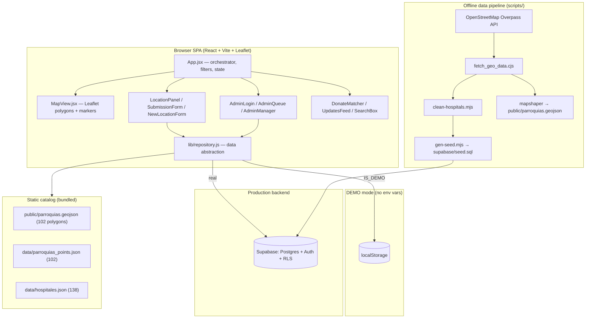

# Full Breakdown — `cdifino/unamanovzla` ("Mapa de Ayuda")

**Author:** Daniel Monroy (dmon)
**Research date:** 2026-06-29
**Repo:** [`cdifino/unamanovzla`](https://github.com/cdifino/unamanovzla) (public, 0 stars, no license file)
**Repo description:** *"organizar las donaciones para que lleguen al lugar donde mas lo necesitan"* (organize donations so they reach where they're most needed)
**Production site:** `www.unamanovzla.com` (custom domain) / `https://cdifino.github.io/unamanovzla/`
**Created:** 2026-06-27 · **Last push:** 2026-06-29 · **Commits:** 9 · **Primary author:** Camila Di Fino

---

## 1. TL;DR

`unamanovzla` (internally "Mapa de Ayuda") is a **crowd-sourced humanitarian-aid coordination map** built in response to a **June 24 earthquake in Venezuela**, covering the states of **Miranda, Distrito Capital, and La Guaira (Vargas)**. It answers three questions per zone: *who is helping and where, what is the current severity/status, and what supplies are needed and where to send them.* (`README.md:1-11`, `src/components/Header.jsx:10`)

It is a **single-page React app** (Vite + Leaflet) backed by **Supabase** (Postgres + Auth + Row-Level Security), with a clever **zero-backend "DEMO" fallback** that stores everything in `localStorage` so the site works with no configuration. Static hosting is on **GitHub Pages** via GitHub Actions. (`package.json`, `src/lib/repository.js`, `.github/workflows/deploy.yml`)

It is an **early MVP** (4 days old, 9 commits, one author, no tests/lint/issues). The core flow works and the build is clean, but the most important gaps are: **no real-time data sync** (a serious limitation for a live-crisis tool), **questionable source-data quality** (62 hospitals were wrongly imported from Paraguay and had to be deleted), **weak abuse/spam protection** on a fully public write endpoint, **stale documentation**, and **no automated testing or quality tooling**.

---

## 2. What they're trying to achieve

### Mission
Coordinate humanitarian response after the earthquake by giving everyone a single live map where they can see, by zone:

- **¿Quién está ayudando y dónde?** — rescue teams, buildings being searched (`README.md:9`)
- **¿Cuál es el estado actual?** — severity level, people being treated in hospitals (`README.md:10`)
- **¿Qué se necesita y a dónde enviarlo?** — supplies, blood, and the donation drop-off/contact point (`README.md:11`)

### Two personas (`README.md:13-22`)
| Persona | Capabilities |
|---|---|
| **Lector** (anyone, no login) | View the map, open each parroquia/hospital, read its status, and **submit reports** (which stay *pending* until approved). |
| **Administrador** | Log in, **review/publish or reject** public reports, and edit any location directly. |

Every public submission enters as **`pending`** and is **not shown** until an admin approves it — a moderation-gated trust model appropriate for a crisis context where misinformation is dangerous. (`README.md:20-21`, `supabase/schema.sql:104-106`)

### Two point types (`README.md:23-31`, `src/data/constants.js:14-18`)
- **Parroquias** (shaded polygons): rescue teams, buildings under search, needed supplies, donation drop-off.
- **Hospitales** (markers): people treated, **blood-donation** need + types, supplies, donation drop-off.
- (A third generic **"otro"** type exists for shelters/collection centers — public can propose these.)

Color encodes **severity**: Crítico · Alto · Medio · Estable · Sin datos. (`src/data/constants.js:2-10`)

---

## 3. Architecture at a glance

### Layers

**1. Frontend** — React 18 + Vite 4, Leaflet 1.9 / react-leaflet 4 for mapping. Entry `src/main.jsx` → `src/App.jsx`. UI is entirely in Spanish, ~14 components, ~3,700 lines of source total. Styling is a single hand-written `src/index.css` (401 lines, 3 responsive breakpoints). (`package.json:14-26`, `src/index.css:102,380,399`)

**2. Data-access layer (the key design idea)** — `src/lib/repository.js` exports a single `repo` object that is **either** `demoRepo` (localStorage) **or** `supaRepo` (Supabase), chosen at load time by `IS_DEMO = !url || !anonKey`. Both implement the same async interface (`getLocations`, `createLocation`, `updateLocationStatus`, `createSubmission`, `getSubmissions`, `reviewSubmission`, auth methods…), so every component is backend-agnostic. (`src/lib/supabaseClient.js:8-10`, `src/lib/repository.js:99-216`, `:221-414`)

**3. Static catalog vs. dynamic status** — Geography + names (102 parroquias + 138 hospitales = **240 base locations**) ship **bundled in the app** as JSON/GeoJSON. Only the *dynamic status* (severity, supplies, rescue, blood, etc.) lives in the database. `getLocations()` merges the bundled catalog with DB rows by `id`. A bounding-box guard (`inRegion`, lat 9.5–11.2 / lng −67.6 to −65.5) hides any stray out-of-region rows. (`src/lib/repository.js:11-41`, `:222-235`)

**4. Backend (Supabase)** — Three tables (`locations`, `submissions`, `admins`) with Row-Level Security. Public read on locations, public insert of `pending` submissions, admin-only review/edit, super-admin-only management of admins. Two `security definer` SQL helpers `is_admin()` / `is_super()` drive the policies. (`supabase/schema.sql`)

**5. Data pipeline (offline scripts)** — `scripts/fetch_geo_data.cjs` pulls parroquia boundaries + hospitals from the **OSM Overpass API**, infers state/municipio by point-in-polygon, slugifies IDs, and writes the catalog. `mapshaper` simplifies the 12 MB raw GeoJSON to a 211 KB web version (`npm run gen:geojson`). `clean-hospitals.mjs` strips bad rows and emits a cleanup SQL. `gen-seed.mjs` regenerates `supabase/seed.sql`. (`scripts/*`, `package.json:11-12`)

**6. Deployment** — `.github/workflows/deploy.yml` builds on push to `main` and deploys `dist/` to GitHub Pages, injecting `VITE_SUPABASE_URL` / `VITE_SUPABASE_ANON_KEY` from repo secrets. `vite.config.js` uses `base: './'` for relative asset paths; `public/CNAME` sets the custom domain. (`.github/workflows/deploy.yml`, `vite.config.js:6`, `public/CNAME`)

---

## 4. Feature inventory

| Feature | Component(s) | Notes |
|---|---|---|
| Interactive map, severity-colored polygons + markers | `MapView.jsx` | Polygons only render for filtered set; markers in a top pane so they stay clickable (`MapView.jsx:63-85,120-122`) |
| Filter by state / kind | `App.jsx:135-159` | Chips for state + parroquia/hospital/otro |
| Keyword + place search w/ suggestions | `SearchBox.jsx`, `lib/search.js` | Builds frequent keywords from supplies/rescue text; accent-insensitive (`search.js:43-59`) |
| Location detail panel | `LocationPanel.jsx` | Different fields for hospital vs parroquia |
| Public report submission (moderated) | `SubmissionForm.jsx` | Honeypot anti-spam field (`SubmissionForm.jsx:21,29-32,84-87`) |
| Propose a brand-new point (click map) | `NewLocationForm.jsx`, `App.jsx:84-87` | Map-click placement; also moderated |
| Admin review queue | `AdminQueue.jsx` | Edit proposed values + severity before publishing |
| Admin direct edit (instant publish) | `LocationPanel.jsx:18-91` | `AdminEdit` form |
| Self-service admin onboarding | `AdminLogin.jsx`, `repository.js:317-373` | Request access → pending → super-admin approves |
| Super-admin management + (informational) center assignment | `AdminManager.jsx` | Approve/reject/revoke; assign a location label |
| Password reset flow | `AdminLogin.jsx` (forgot), `ResetPassword.jsx` | Supabase recovery email + `PASSWORD_RECOVERY` handling (`App.jsx:50-52`) |
| "Quiero donar" matcher | `DonateMatcher.jsx`, `search.js:73-98` | Type what you can donate → suggests places needing it, ranked by severity |
| Updates feed (timeline) | `UpdatesFeed.jsx` | Locations sorted by `updated_at`, filterable |
| Community disclaimer (dismissible) | `Disclaimer.jsx` | "Confirm with the contact before mobilizing resources" |
| DEMO badge when no backend | `Header.jsx:17` | |

---

## 5. Data model (`supabase/schema.sql`)

- **`locations`** — `id` (text slug PK), `name`, `kind` ∈ {parroquia, hospital, otro}, `state`, `municipio`, `lat/lng`, plus status fields: `status_level` (default `sin_datos`), `summary`, `supplies_needed`, `donation_poc`, `rescue_teams`, `buildings_searched`, `people_aided`, `blood_needed`, `blood_types`, `updated_at`, `updated_by`. (`schema.sql:8-27`)
- **`submissions`** — `id` (uuid), optional `location_id` (FK, cascade), `location_name`, `kind`, `submitter_name`, `submitter_contact`, `update_type`, `message` (required), `proposed` (jsonb — the editable patch), `new_location` (bool), `status` ∈ {pending, approved, rejected}, timestamps, `reviewed_by`. (`schema.sql:29-46`)
- **`admins`** — `user_id` (FK → `auth.users`), `email`, `full_name`, `status`, `is_super`, `assigned_location_id`, `assigned_label`, request/review timestamps. Approved-only counts as admin; assignment is **informational only** — every approved admin can edit any location. (`schema.sql:52-63`, `admins_onboarding.sql:6-10`)

---

## 6. Security model — analysis

**Strengths**
- RLS is enabled on all three tables and policies are coherent. Public can only **read** locations and **insert `pending`** submissions; reading/reviewing submissions and editing locations require `is_admin()`; managing admins requires `is_super()`. (`schema.sql:90-141`)
- Privilege escalation is blocked at the DB: the self-insert policy forces `status='pending'`, `is_super=false`, `assigned_location_id is null`, so a user cannot self-approve or self-promote. (`schema.sql:122-130`)
- `is_admin()`/`is_super()` are `security definer ... set search_path = public`, avoiding search-path hijacking. (`schema.sql:70-88`)
- No `dangerouslySetInnerHTML` anywhere → stored user content is React-escaped, so persisted-XSS risk is low. (verified: no matches in `src/`)
- The publishable **anon key in the bundle is expected** for Supabase; RLS is the real boundary.

**Weaknesses / risks**
1. **Unthrottled public write = spam/DoS surface.** Anyone can `insert` into `submissions` directly via the public anon key (the client honeypot is trivially bypassed by calling the REST API). There is no rate limiting, CAPTCHA, or server-side validation, and `message`/text fields are unbounded Postgres `text`. In a high-traffic crisis this table could be flooded, drowning moderators or bloating the DB. (`schema.sql:104-106`, `SubmissionForm.jsx:29-32`) — *highest-severity security item.*
2. **PII collected during a crisis.** `submitter_contact` (phone/email) is stored. RLS restricts reads to admins (good), but there's no retention/cleanup policy and submissions accumulate forever (no DELETE policy). (`schema.sql:108-114`)
3. **Moderation is the only correctness gate.** Approved content is fully trusted; there's no provenance, no edit history, and no rejection reason captured — acceptable for an MVP but thin for life-safety decisions.
4. **DEMO admin password `admin123`** is real only in demo, clearly labeled, and not a production path — fine, but worth not copy-pasting patterns. (`repository.js:52,164-170`)

---

## 7. Code quality & repo health

**Good**
- Clean separation via the repository pattern; components are small and single-purpose.
- Build is green and fast: `vite build` → 136 modules, **1.18s**, no errors. (verified)
- Thoughtful UX touches: accent-insensitive search, honeypot, dismissible disclaimer, responsive CSS, demo mode, `flyTo` on search, severity-ranked donation matching.
- Sensible code comments (in Spanish) explaining non-obvious decisions (e.g., the `inRegion` safety net, marker pane z-index).

**Gaps**
- **No tests, no linter, no formatter, no type-checking.** No ESLint/Prettier/tsconfig/Jest/Vitest config exists. The only "tests" are a manual Puppeteer script and a screenshot script. (verified: no config files found)
- **`scripts/e2e.mjs` is non-portable** — hardcoded Windows Chrome path `C:/Program Files/Google/Chrome/Application/chrome.exe`, not wired into CI. (`scripts/e2e.mjs:3`)
- **`scripts/fetch_geo_data.cjs` hardcodes** `C:\Users\cadifino\mapa-ayuda` as ROOT — won't run on another machine without editing. (`fetch_geo_data.cjs:6`)
- **CI has no test/lint gate** — deploy workflow only builds + publishes. (`.github/workflows/deploy.yml`)
- **Single 611 KB JS bundle** (171 KB gzip), no code-splitting; Vite warns >500 KB. Leaflet + supabase load eagerly. (verified build output)
- **12 MB unsimplified `src/data/parroquias.geojson` committed** to git (the simplified 211 KB version is what ships). Repo bloat; a candidate for `.gitignore`/regeneration or Git LFS. (`ls -lh` output)
- **`npm install` reports 9 vulnerabilities (5 high)** in the dependency tree (transitive; e.g., older `puppeteer-core`/`mapshaper` toolchain). (verified)
- **No `LICENSE` file** despite README referencing ODbL for the *data*; the *code* has no stated license. (`gh repo view` → `licenseInfo: null`)

---

## 8. What needs the most work (prioritized)

> Ordered by impact on the app's actual mission (coordinating live aid reliably).

### P0 — Real-time / freshness of data
The single biggest functional gap. `repo.getLocations()` runs **once on mount** and after local mutations; there are **no Supabase realtime subscriptions** (only `auth.onAuthStateChange` is used). During an active disaster, an admin publishing an update will **not** propagate to other open browsers until they manually reload, and the "Actualizaciones" feed is just the in-memory list sorted by `updated_at` — not a live event stream. For a tool whose value is timeliness, this undercuts the core promise.
*Fix:* add `supabase.channel(...).on('postgres_changes', …)` subscriptions for `locations` (and the admin queue), or at minimum a periodic poll / manual "refresh" affordance. (`src/lib/repository.js:222-235,408-411`, `src/App.jsx:39-54`)

### P0 — Source-data quality & trust
The OSM import is **demonstrably unreliable**: 62 hospitals had to be deleted because the Overpass query `area["admin_level"="4"]["name"="Distrito Capital"|"Miranda"|"La Guaira"]` matched **same-named regions elsewhere** — the deleted set is full of **Paraguayan** facilities (Asunción = Paraguay's "Distrito Capital": "Sanatorio Migone", "Hospital de Loma Pyta", "Instituto de Previsión Social", etc.). The fixes (`inRegion` bbox + `clean-hospitals.mjs` generic-name filter) are band-aids over an ambiguous name-based query, and the surviving 138 hospitals aren't independently verified. Wrong/missing hospitals in a disaster map are a safety problem.
*Fix:* constrain Overpass by **area relation/ID (e.g., Venezuela ISO/`ISO3166-2`) or a country bbox**, not bare admin-level names; add a verification pass; document provenance per row. (`supabase/cleanup_locations.sql:1-70`, `scripts/fetch_geo_data.cjs:187-196,144-151`, `repository.js:34-41`)

### P1 — Abuse protection on public writes
See §6.1. Add rate limiting (e.g., a Supabase Edge Function or `pg` policy with throttling), length checks on `message`/`proposed`, and ideally a real CAPTCHA — the client honeypot stops only naïve bots. (`schema.sql:104-106`)

### P1 — Documentation accuracy
The README is **already stale**: it claims **"302 ubicaciones (102 parroquias + 200 hospitales)"** in two places, but the generated seed and data say **240 (102 + 138)**. It also references the `cdifino.github.io/unamanovzla/` URL while the site now uses the `www.unamanovzla.com` custom domain. Misleading docs erode trust for new contributors/operators. (`README.md:62,128` vs `supabase/seed.sql:1-4`, `public/CNAME`)

### P1 — Attribution bug on admin direct edits
`updated_by` is only set on the **queue-approval** path (`AdminQueue.jsx:55`), **not** when an admin edits a location directly via `AdminEdit` → `updateLocationStatus` (`LocationPanel.jsx:35-43`, `repository.js:252-259`). So direct admin edits show "updated" with no author, weakening the audit trail. Easy fix: include the current admin's email/name in the patch.

### P2 — Testing, CI quality gates, and tooling
Add ESLint + a minimal Vitest/RTL suite for `lib/search.js` (pure functions — easy wins) and the `repository` demo path; make the e2e script cross-platform (use `puppeteer` w/ bundled Chromium or Playwright); add a `lint`/`test` step to the deploy workflow. (`package.json`, `.github/workflows/deploy.yml`, `scripts/e2e.mjs`)

### P2 — Performance & scale hygiene
Code-split the bundle (lazy-load admin/modals), and add pagination/limits: `getLocations()`/`getSubmissions()` use unbounded `select('*')` and Supabase caps at ~1,000 rows by default — fine at 240 today, risky as new locations/submissions grow. (`repository.js:222-235,269-275`)

### P3 — Repo hygiene
Stop committing the 12 MB raw GeoJSON (regenerate or LFS); add a `LICENSE`; run `npm audit fix` for the dev toolchain; remove machine-specific hardcoded paths from scripts.

---

## 9. Quick wins (low effort, real value)
- Fix README counts 302→240 / 200→138, and the production URL. (`README.md:62,128`)
- Set `updated_by` in `AdminEdit` save. (`LocationPanel.jsx:35-43`)
- Add unit tests for `lib/search.js` (`matchDonations`, `buildKeywords`, `normalize`) — pure, deterministic.
- Add a "Refrescar" button (or 30–60s poll) as an interim freshness measure before full realtime.
- Add basic length caps / a server check on `submissions.message`.
- Add `src/data/parroquias.geojson` (12 MB) to `.gitignore` and document regeneration.

---

## 10. Assumptions & uncertainty
- **The earthquake context is taken from the repo's own copy** (`Header.jsx:10` "terremoto en Venezuela del 24 de junio", README). I did not independently verify a June 24 2026 earthquake via external sources; treat the event framing as the project's stated premise, not a fact I confirmed. The dates in git (`2026-06-26…29`) are whatever the committing environment reported.
- **I could not exercise the live Supabase backend** (no credentials; the app ran in DEMO mode locally). Production RLS behavior is inferred from `schema.sql`, which is consistent and idempotent but may differ from what's actually deployed.
- **Hospital count "138"** is the current `hospitales.json`/`seed.sql` value; the README's "200" likely reflects a pre-cleanup snapshot. The earlier `cleanup_locations.sql` lists 62 deletions, and `clean-hospitals.mjs` is the generator — exact historical counts before cleanup weren't reconstructed.
- **No open issues or PRs exist** on the GitHub repo, so "what needs work" is derived from code/docs analysis, not a maintainer backlog. (`gh issue list`/`gh pr list` → empty)

---

## 11. Key file reference (citations)
- Product/spec: `README.md`, `docs/promo/README.md`
- Orchestration & state: `src/App.jsx`
- Data abstraction (demo vs Supabase): `src/lib/repository.js`, `src/lib/supabaseClient.js`
- Map rendering: `src/components/MapView.jsx`
- Public submission + new point: `src/components/SubmissionForm.jsx`, `src/components/NewLocationForm.jsx`
- Admin: `src/components/AdminLogin.jsx`, `AdminQueue.jsx`, `AdminManager.jsx`, `ResetPassword.jsx`
- Discovery/UX: `src/components/SearchBox.jsx`, `DonateMatcher.jsx`, `UpdatesFeed.jsx`, `Legend.jsx`, `Disclaimer.jsx`, `Header.jsx`, `src/lib/search.js`
- Constants/data: `src/data/constants.js`, `src/data/parroquias_points.json` (102), `src/data/hospitales.json` (138), `public/parroquias.geojson` (102 features)
- Backend: `supabase/schema.sql`, `supabase/admins_onboarding.sql`, `supabase/seed.sql` (240), `supabase/cleanup_locations.sql` (62 deletions)
- Pipeline: `scripts/fetch_geo_data.cjs`, `scripts/clean-hospitals.mjs`, `scripts/gen-seed.mjs`, `scripts/screenshots.mjs`, `scripts/e2e.mjs`
- Build/deploy: `package.json`, `vite.config.js`, `.github/workflows/deploy.yml`, `public/CNAME`, `.env.example`
